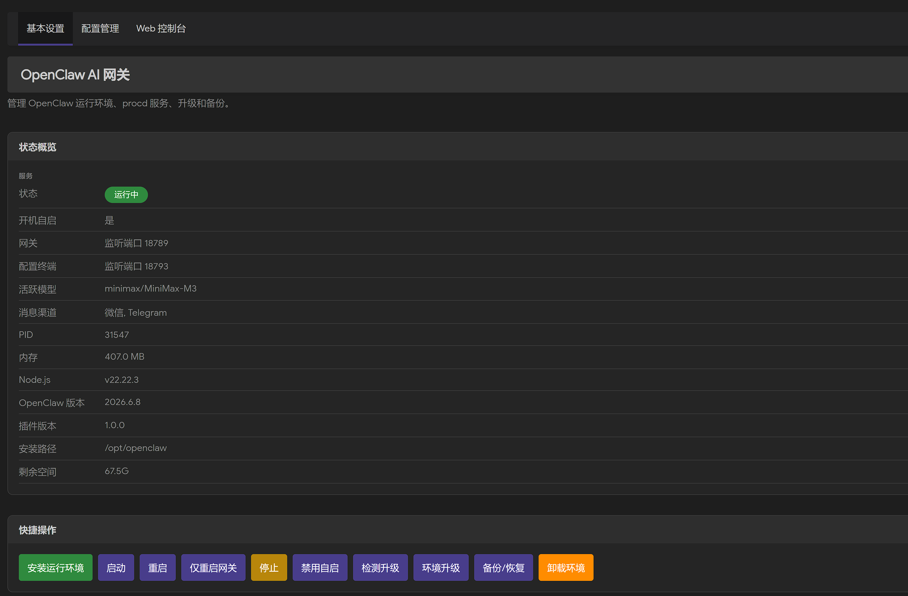
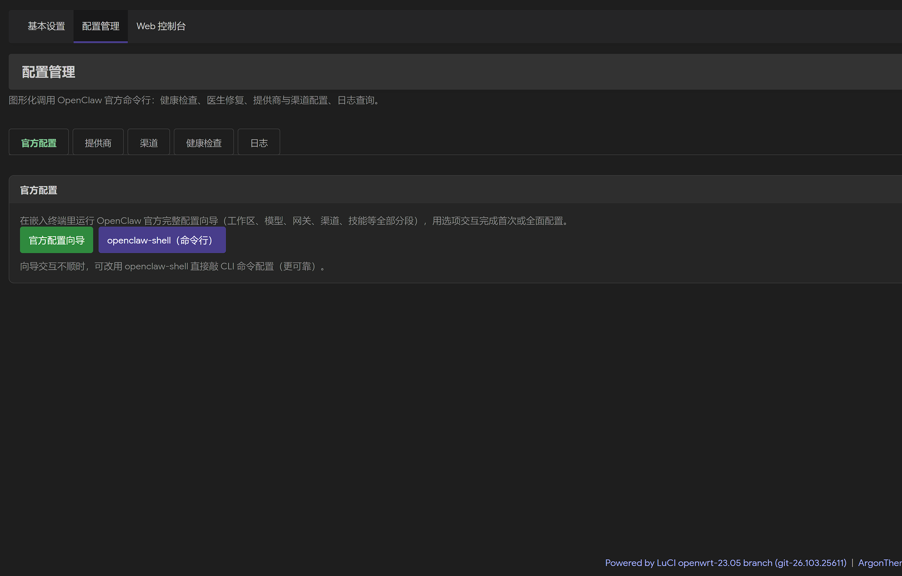
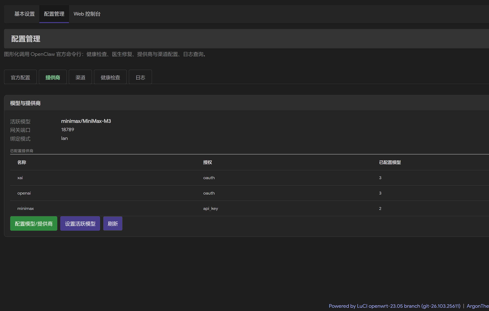
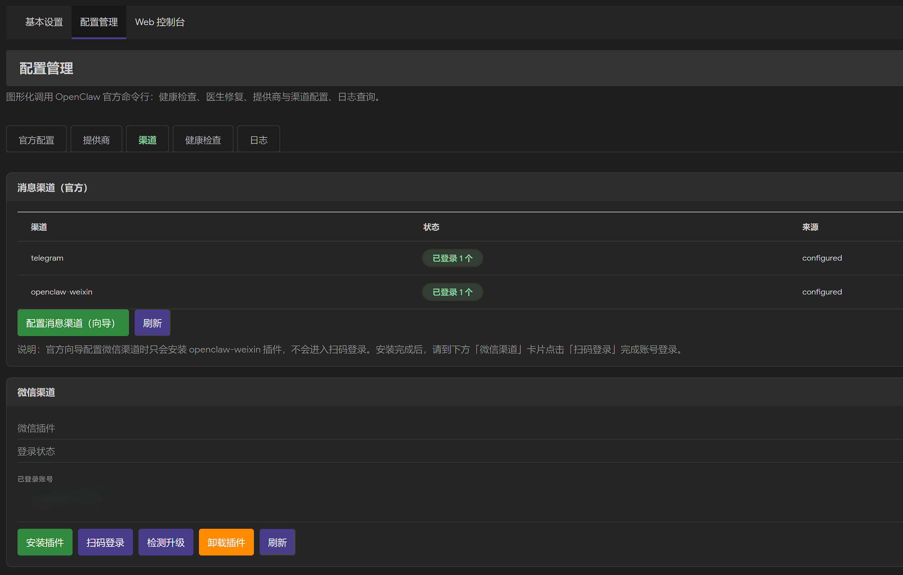
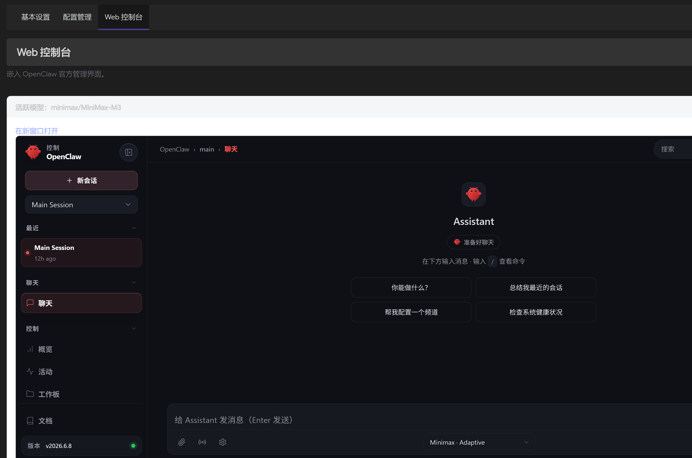

# luci-app-openclaw

[](https://github.com/tonylee2022/luci-app-openclaw/actions/workflows/build.yml)
[](LICENSE)

OpenClaw AI 网关的 OpenWrt / iStoreOS LuCI 管理插件。

在路由器上运行 OpenClaw，并通过 LuCI 图形界面完成运行环境安装、服务管理、模型/渠道配置、升级与备份——大量功能用官方 CLI 驱动，尽量减少对交互式向导的依赖。OpenClaw 始终以非 root 的 `openclaw` 用户运行。

<div align="center">
  
</div>

## 🖼 界面截图

<table>
  <tr>
    <td width="50%" valign="top"><br/><sub><b>配置管理 · 官方配置</b>：网页内嵌真实终端运行官方向导，或一键进入 openclaw-shell 命令行。</sub></td>
    <td width="50%" valign="top"><br/><sub><b>配置管理 · 提供商</b>：已配置提供商（授权方式 / 模型数），可设置活跃模型。</sub></td>
  </tr>
  <tr>
    <td width="50%" valign="top"><br/><sub><b>配置管理 · 渠道</b>：微信扫码登录、Telegram Bot Token 配置与配对。</sub></td>
    <td width="50%" valign="top"><br/><sub><b>Web 控制台</b>：内嵌 OpenClaw 官方管理界面，直接对话与管理。</sub></td>
  </tr>
</table>

## ✨ 功能特性

### 基本设置（服务 → OpenClaw → 基本设置）
- **状态概览**：运行状态徽标（运行中 / 启动中 / 已停止，带呼吸光环、固定配色不随主题漂移）、开机自启（可一键切换）、网关与配置终端端口、活跃模型、消息渠道、PID、内存、Node.js / OpenClaw / 插件版本、安装路径、剩余空间。
- **快捷操作**：安装运行环境、启动 / 重启 / 仅重启网关 / 停止、切换开机自启、检测升级（LuCI 插件）、环境升级、备份/恢复、卸载环境。每个操作点击即在信息栏提示「XX 命令已提交」，长任务带日志面板与「关闭=停止并杀进程」语义。
- **安装运行环境**：自动列出可用磁盘挂载点及可用空间（排除 overlay/tmpfs 等），选择安装位置 + 版本（稳定版/最新版），安装前做容量与写入权限检查。
- **环境升级**：升级 OpenClaw 到最新版、原地升级捆绑 npm、升级指定版本 Node.js（升级后自动重启网关）。
- **备份与恢复**：创建「仅配置」或「完整」备份，支持验证 / 恢复 / 删除。备份默认保存在**安装目录之外**（`<安装基础目录>/openclaw-backups`），因此**卸载环境不会删除备份**；备份目录可在备份窗口内自定义（须位于安装目录之外）。
- **快速指南** 与项目链接。

### 配置管理（服务 → OpenClaw → 配置管理）
- **官方配置**：在网页内嵌的真实终端（ttyd）里以 `openclaw` 身份运行官方 `openclaw configure` 向导；或一键进入 **openclaw-shell** 命令行，直接敲 CLI 配置/交互，面板内含「重启网关」并就地显示完整重启进度。
- **提供商**：展示已配置提供商（授权方式、已配置模型数，数据源自 `agents.defaults.models` 与 `auth.profiles`）；「设置活跃模型」从已授权的已配置模型中选择并切换默认模型。
- **渠道**：仅列出已配置渠道。
  - **微信渠道**：安装插件 / 扫码登录（清晰可扫的二维码）/ 检测升级 / 卸载 / 已登录账号管理；登录前自动幂等启用插件，避免核心升级后掉注册导致登录失败。
  - **Telegram 渠道**：填入 Bot Token 一键配置（`channels add`，绕开易错的向导）；并提供**配对**：填配对码审批私信发起者 / 查看待配对请求。
- **健康检查**：运行 `openclaw doctor`（lint / 一键修复）。
- **日志**：网关日志查看（行数 50/100/200、加载、清空、2 秒自动刷新）。

### 其它
- **Web 控制台**：嵌入 OpenClaw 控制台。
- **主题适配**：插件自带明/暗两套样式，跟随当前 LuCI 主题（如 Argon）的明暗自动切换。
- **安全模型**：OpenClaw 以 `openclaw` 系统用户运行；`openclaw` / `openclaw-shell` 在以 root 调用时自动降权，避免产生 root 属主文件与触发 OpenClaw 的临时目录安全校验失败。

## 系统要求

| 项目 | 要求 |
|------|------|
| 架构 | x86_64 或 aarch64 (ARM64) |
| C 库 | musl（自动检测；离线包仅支持 musl） |
| 依赖 | luci-base、rpcd-mod-ucode、curl、openssl-util、tar、script-utils、ttyd、qrencode |
| 存储 | **2GB 以上可用空间** |
| 内存 | 推荐 1GB 及以上 |

## 当前适配版本

| 组件 | 默认版本 | 说明 |
|------|----------|------|
| OpenClaw | `2026.6.6` | 维护者验证稳定版；「最新版」/升级使用 npm 正式 `latest` 标签 |
| Node.js | `22.22.3` | 最低要求 `22.19.0`；安装后还会按 OpenClaw `engines.node` 强校验 |
| 微信插件 | 官方兼容版本 | `@tencent-weixin/openclaw-weixin@latest` |

## 📦 安装

### 方式一：.run 自解压包（推荐）

无需 SDK，适用于已安装好的系统。

```bash
VER=$(curl -sI "https://github.com/tonylee2022/luci-app-openclaw/releases/latest" 2>/dev/null | grep -i "location:" | sed 's/.*tag\/v\{0,1\}//' | tr -d '\r\n')
wget "https://github.com/tonylee2022/luci-app-openclaw/releases/download/v${VER}/luci-app-openclaw_${VER}.run"
sh "luci-app-openclaw_${VER}.run"
```

### 方式二：.ipk 安装

```bash
VER=$(curl -sI "https://github.com/tonylee2022/luci-app-openclaw/releases/latest" 2>/dev/null | grep -i "location:" | sed 's/.*tag\/v\{0,1\}//' | tr -d '\r\n')
wget "https://github.com/tonylee2022/luci-app-openclaw/releases/download/v${VER}/luci-app-openclaw_${VER}-1_all.ipk"
opkg install "luci-app-openclaw_${VER}-1_all.ipk"
```

### 方式三：集成到固件编译

```bash
cd /path/to/openwrt
echo "src-git openclaw https://github.com/tonylee2022/luci-app-openclaw.git" >> feeds.conf.default
./scripts/feeds update -a && ./scripts/feeds install -a
make menuconfig   # LuCI → Applications → luci-app-openclaw
make package/luci-app-openclaw/compile V=s
```

## 🔰 首次使用

1. 打开 LuCI → **服务 → OpenClaw → 基本设置**，点击「安装运行环境」，选择有 ≥2GB 空间的挂载点与版本，等待安装完成（会自动启动服务）。
2. 到 **配置管理 → 官方配置**，用「官方配置向导」或「openclaw-shell」配置工作区、模型、网关等；或在 **Web 控制台** 添加模型与 API Key。
3. 到 **配置管理 → 渠道** 配置消息渠道：微信（安装插件 → 扫码登录）、Telegram（填 Bot Token → 配对）。
4. 配置改动后点「重启」/「重启网关」使其生效；状态徽标显示「运行中」即正常。

## 命令行使用

安装后提供以下命令（均以 `openclaw` 用户身份运行，root 调用会自动降权）：

```bash
openclaw --version              # 运行 OpenClaw CLI（仅对当前命令注入环境）
openclaw status
openclaw-shell                  # 进入隔离的 openclaw 用户子 Shell（exit 退出）
openclaw-env check              # 检查运行环境
openclaw-env upgrade            # 升级 OpenClaw 到 npm latest
openclaw-env node               # 下载/更新默认 Node.js（可用 NODE_VERSION=x.y.z 指定版本）
```

自定义安装路径时，可为单次命令设置 `OPENCLAW_INSTALL_PATH`：

```bash
OPENCLAW_INSTALL_PATH=/mnt/data openclaw status
```

## 自定义安装路径

UCI 字段为 `openclaw.main.install_path`，语义为**基础目录**，实际运行目录固定展开为 `<基础目录>/openclaw`：

```bash
uci set openclaw.main.install_path='/mnt/data'
uci commit openclaw
openclaw-env setup
```

全新安装的目录布局（接近官方 HOME）：

```text
/mnt/data/openclaw/
├── node/          # Node.js 运行时
├── .npm-global/   # OpenClaw、pnpm 等全局 npm 包
├── .npm/          # npm 缓存
├── .openclaw/     # OpenClaw 配置、状态、会话和插件
└── .tmp/          # npm/插件运行临时目录
```

安装前会执行写入探针；overlay 已满、只读或外置盘未挂载时会在下载前失败并给出明确日志。当前版本不支持旧布局原地升级，检测到旧布局或安装目录有未知文件时会停止并提示先卸载。

## 🔒 安全模型

- OpenClaw 强制以 `openclaw` 系统用户运行：以 root 运行会因其临时目录安全校验（要求目录属主等于当前 uid）被拒，且会在家目录留下 root 属主文件。
- `/usr/bin/openclaw` 与 `openclaw-shell` 在被 root 调用时**自动 `su` 降权**到 `openclaw` 用户；配置终端（ttyd）也以 `openclaw` 身份运行。
- 插件的启用、禁用、白名单、拒绝列表等策略完全由 OpenClaw 官方机制与用户配置管理，本项目不创建、补全、迁移或清理这些策略。

## 📜 版权与开源声明

本项目以 [GPL-3.0](LICENSE) 许可证开源。

- © 2026 [tonylee2022](https://github.com/tonylee2022/luci-app-openclaw)。
- 本项目在设计与实现上**参考、借鉴**了 [10000ge10000/luci-app-openclaw](https://github.com/10000ge10000/luci-app-openclaw)，在此致谢。
- OpenClaw、Node.js、ttyd、qrencode、微信渠道插件（`@tencent-weixin/openclaw-weixin`）等均为各自版权所有者的作品，遵循其各自许可证；本项目仅作集成与管理，不修改其授权策略。
- 按 GPL-3.0：你可以自由使用、修改、再分发本项目；衍生作品须同样以 GPL-3.0 开源、保留版权与许可声明，并且不附带任何担保。

## 📂 目录结构

```
luci-app-openclaw/
├── Makefile                          # OpenWrt 包定义
├── htdocs/luci-static/resources/
│   ├── openclaw/                     # 共享 RPC 客户端、UI 助手、样式、二维码库
│   └── view/openclaw/                # 现代 LuCI JavaScript 页面（基本设置/配置管理/控制台）
├── root/
│   ├── etc/
│   │   ├── config/openclaw           # UCI 配置
│   │   ├── init.d/openclaw           # procd 服务脚本
│   │   └── uci-defaults/99-openclaw  # 初始化脚本
│   └── usr/
│       ├── libexec/                  # 共享 Shell helper 与 RPC 执行层（openclaw-rpc.sh、openclaw-paths.sh、openclaw-wizard.sh）
│       ├── bin/openclaw              # OpenClaw CLI 隔离包装器（root 调用自动降权）
│       ├── bin/openclaw-shell        # 隔离子 Shell（切换到 openclaw 用户）
│       ├── bin/openclaw-env          # 环境安装/检查/升级工具
│       └── share/
│           ├── luci/menu.d/          # LuCI 菜单
│           ├── rpcd/                 # ucode API（luci.openclaw）与 ACL
│           └── openclaw/             # 配置终端资源
├── scripts/                          # 本地 .ipk / .run 构建与发布脚本
└── .github/workflows/                # 在线构建并发布到 GitHub Release
```

## 贡献

欢迎在 [Issues](https://github.com/tonylee2022/luci-app-openclaw/issues) 反馈问题、提交 Pull Request。

## License

[GPL-3.0](LICENSE)
